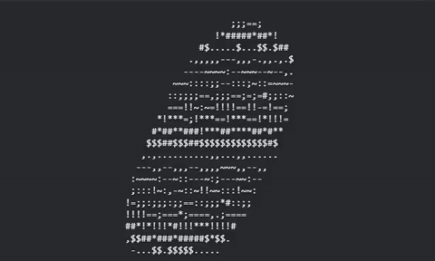

# 🍩 ASCII Torus Renderer — A Spiraling 3D Donut in Pure Python


This project renders a **fully rotating 3D torus (donut)** inside your terminal using nothing but Python, NumPy, trigonometry, and raw ASCII characters.  
It’s a tiny experiment in **parametric surfaces, Euler-angle rotation, depth buffering, and terminal-based shading**—all wrapped into one hypnotic spiraling animation.

## 🧠 What’s Happening Here?

The donut is generated using the **parametric equations of a torus**, rotated through two independent angles `A` and `B`, then projected onto a 2D terminal grid using a handmade perspective model:

- **Parametric geometry:** `(R + cos(i)) * cos(j)`  
- **Euler rotations:** applied across X and Z axes  
- **Depth buffer:** prevents far-side glyphs from overwriting near ones  
- **ASCII luminance ramp:** gives the illusion of lighting and curvature  

In short:  
**Real math. Fake graphics card. Very real donut.**

## 🚀 Run It

```bash
python donut.py
